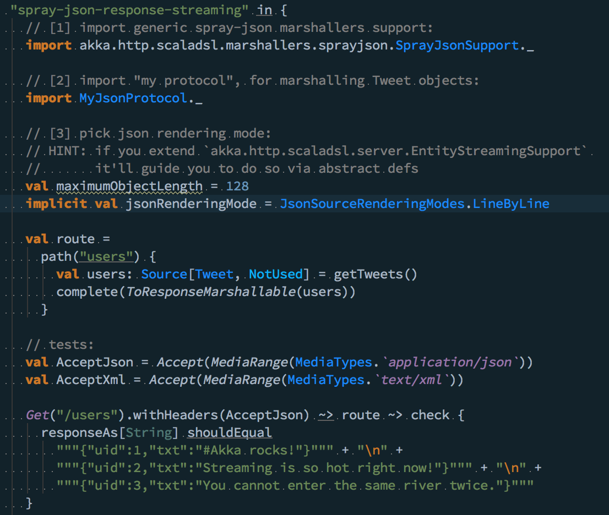

# intellij-colors-happy-hakking
My custom IntelliJ colour scheme, nicknamed "happy hakking"

Notable things
--------------

- Source Code Pro font
- objects have different share of blue then classes / traits
- keywords are orange

Example
-------

Installation
------------

Back up your settings, in case you would like to revert to them. Select the **Configure** | **Export Settings...**  menu on the "Welcome to IntelliJ IDEA" window, or the **File** | **Export Settings...** menu when a project is open, and save to a file.

To install:

1. Select the **Configure** | **Import Settings...**  menu on the "Welcome to IntelliJ IDEA" window, or the **File** | **Import Settings...** menu when a project is open.
2. Specify the `haking-codestyle-settings.jar` file. Click OK in the dialog that appears.
2. Allow IntelliJ IDEA to restart.
3. Go to **Configure** | **Settings**  menu on the "Welcome to IntelliJ IDEA" window, or the **File** | **Settings**  menu when a project is open, then select **Editor** | **Colors & Fonts** and select the new color scheme, `Darcula-akka`.
